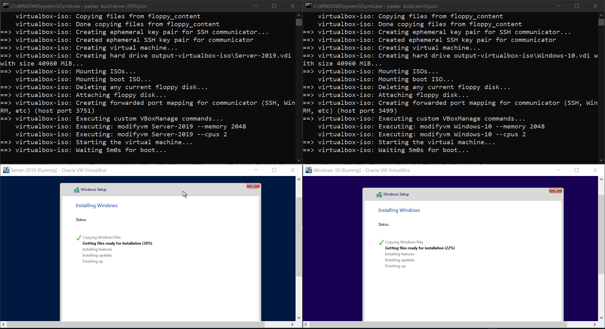
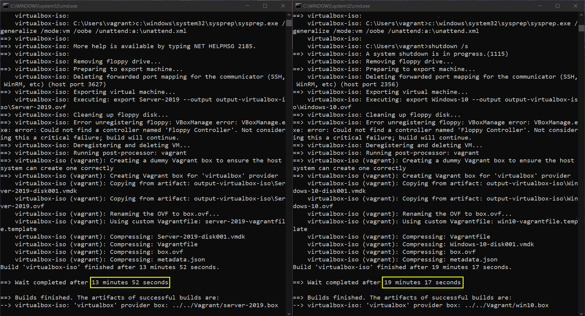

# Auror-Project
Recently, I stumbled on an initiative called "The Auror Project" by [Sudarshan Pisupati](https://www.linkedin.com/in/sudarshan-pisupati-607b0ab/) which was starting a course called "[3 Machine Labs](https://www.linkedin.com/feed/update/urn:li:activity:6919205808157155328/)". 
"3 Machine Labs" is a challenge based learning approach to solidify fundamentals of Active Directory over a series of 9 sessions. 

## Task I
The first session came with a [challenge](https://docs.google.com/document/d/1Zk_O_JpFQk5JQRGF9CAC0plml3ua3hCQ5VBDLxE2GQI/edit#heading=h.1vlpfqvcrv4) to automate the process of building an Active Directory Lab with some specifications.

Automation should:
- Setup two Virtual Machines; Windows Server & Windows 10 
- Install Active Directory Domain Services(ADDS) on the Windows Server and promote the server to Domain controller through a process called DC Promo
- Add Windows 10 machine to Windows Server domain, through a process called Domain join

Some specifications for the machines were:
For Windows Server (Domain controller):
- Domain name should be "auror.local"
- Has DNS role
- Contains a Domain user called "Adam" with password "Pass@123"

For Windows 10:
- Should've Google Chrome installed
- User "Adam" should be configured as a local administrator
- Firewall should be disabled

### Deployment
1. Download the ISO files in the main(Auror-Project) directory
2. Build ISO using packer with `packer build server-2019.json` & `packer build win10.json` 

   or 

   Even better if you run `.\packer-build.bat` to run both the packer builds parallely.(On windows ofc, for Linux you can use `nohup <cmd> &`)

   which contains:
	```batch
	start cmd /K "cd Packer\server-2019 && packer build server-2019.json"
	start cmd /K "cd Packer\win10 && packer build win10.json"
	```
   
   **Output:**

   Build will take sometime and should look like this:
   

   My build finished in **~20 mins**.
   

3. Now, We've to configure the built base images with vagrant to build our environment.
   ```batch
   cd Vagrant && vagrant up
   ```
My Vagrant took 38 minutes to set up the environment. Taking it as **~40 mins**.

There it is.. Complete lab from scratch in your fingertips within **60 mins**. 

Blog post giving a detailed look for Task I [here](https://0xcaretaker.github.io/posts/Automation-on-the-Fly/).
